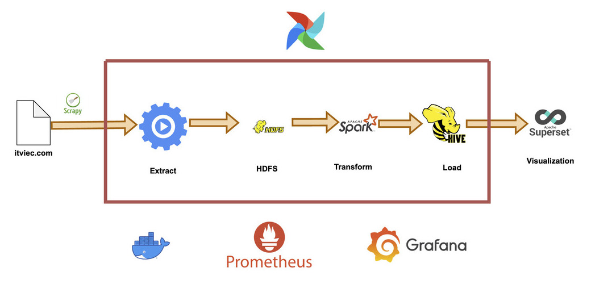
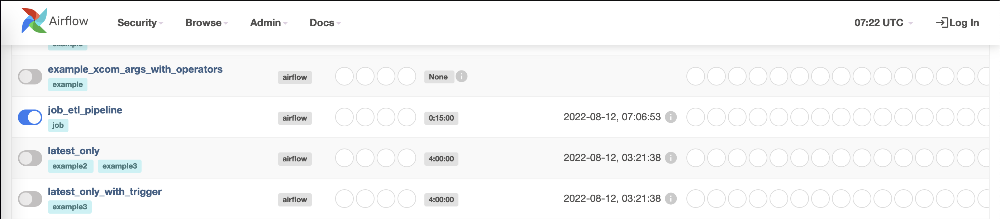
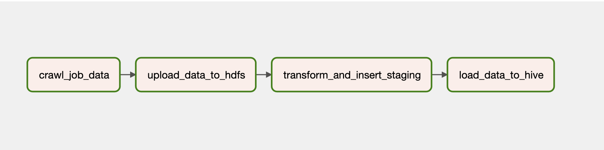
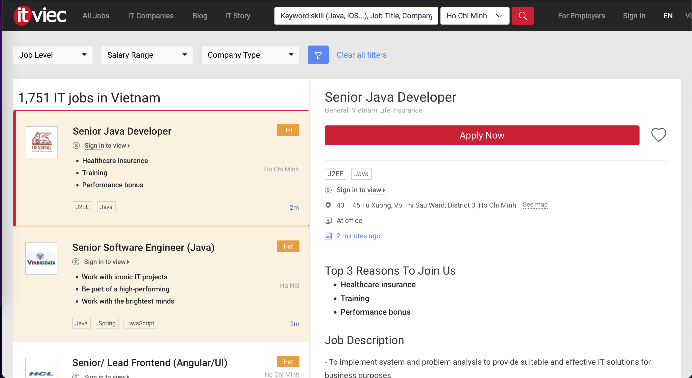
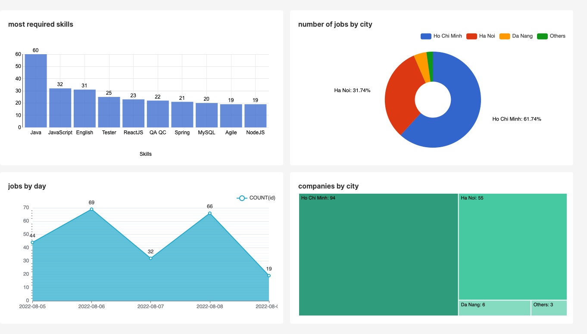
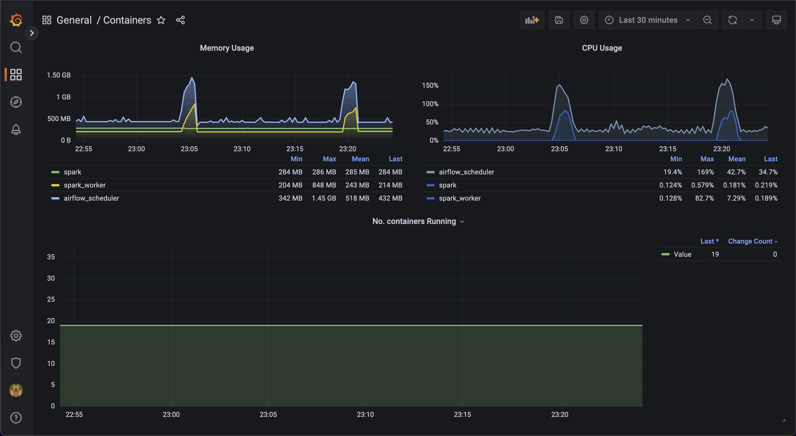

# **Job ETL Pipeline**

<!-- TABLE OF CONTENTS -->
<details>
  <summary>Table of Contents</summary>
  <ol>
    <li><a href="#motivation">Motivation</a></li>
    <li><a href="#built-with">Built With</a></li>
    <li><a href="#usage">Usage</a></li>
    <li><a href="#contributing">Contributing</a></li>
    <li><a href="#contact">Contact</a></li>
  </ol>
</details>


<!-- ABOUT THE PROJECT -->
## Motivation
I want to make a beginner data engineering project, also want to look for a new job. So i make this ETL pipeline that crawl data from job search website, do some transform, store data in data warehouse and load data to visualization tool.

## Built With

* [Airflow](https://airflow.apache.org/)
* [Hadoop (HDFS)](https://hadoop.apache.org/)
* [Spark](https://spark.apache.org/)
* [Hive](https://hive.apache.org/)
* [Superset](https://superset.apache.org/)
* [Docker](https://www.docker.com/)
* [Prometheus](https://prometheus.io/) & [Grafana](https://grafana.com)


## Architecture

1. Extract data using Scrapy
2. Load data into HDFS
3. Use Spark to transform, remove unnecessary data
4. Load data to Hive
5. Create dashboard, write queries in Superset
6. Orchestrate with Airflow in Docker
7. Use Prometheus and Grafana to monitor resources

## Usage


- Clone and cd into the project directory.

```bash
git clone https://github.com/chunguyenduc/Job-ETL-Pipeline.git
cd Job-ETL-Pipeline
```

- Use  `docker compose` to start. The pipeline has a lot of components so this may take a while
```
docker compose up -d
```

- Go to Airflow webserver on [localhost:8080](http://localhost:8080) and turn on our DAG



- Our DAG has four tasks as step 1 to 4 in [Architecture](#architecture). The DAG runs every 15 minutes and crawl the first page of [ITviec](https://itviec.com/it-jobs?page=1&query=&source=search_job)

<!--  -->
|  | 
|:--:| 
| *Tasks* |

|  | 
|:--:| 
| *ITviec Website* |

- Before running Hive, you need to create the `/tmp` folder and a separate Hive folder in HDFS:

```
docker exec -it namenode /bin/bash
hadoop fs -mkdir /tmp 
hadoop fs -mkdir /user/hive/warehouse
hadoop fs -chmod g+w /tmp 
hadoop fs -chmod g+w /user/hive/warehouse
```

- Once the DAG is done running, you can go to Superset on [127.0.0.1:8088](http://127.0.0.1:8088) and query data or create dashboard like this:


- You can also monitor metrics like CPU usage, memory usage on Grafana ([localhost:3000](http://localhost:3000)). I have export [grafana.json](grafana.json) in this repository


- List servers I used in this project

| Service               | URL                              |                                 |
| :-------------------: | :------------------------------: | :-------------------------------------------: |
| Airflow | http://localhost:8080/           |                                           |
| Spark  | http://localhost:8181/           |                                           |
| Superset              | http://127.0.0.1:8088/           |   |
| Prometheus               | http://localhost:9000/           |  |
| Grafana               | http://localhost:3000/           | |

 **Note**: 
  - Username/password is admin/admin
  - Airflow and Superset both use Flask web server. You will not be able to access both servers at the same time because of [CSRF](https://en.wikipedia.org/wiki/Cross-site_request_forgery). I disabled [Airflow authentication](https://airflow.apache.org/docs/apache-airflow/stable/security/webserver.html#web-authentication) but was not able to disable Superset authentication. So I have to change from localhost to 127.0.0.1 to use it


<br />

<!-- CONTRIBUTING -->
## Contributing

If you have a suggestion that would make this better, please fork the repo and create a pull request. Thank you very much!


<!-- CONTACT -->
## Contact

Đức. Chu Nguyên 
- [Linkedin](https://www.linkedin.com/in/nguyenducchu1999/)
- Email: nguyenducchu1999@gmail.com
