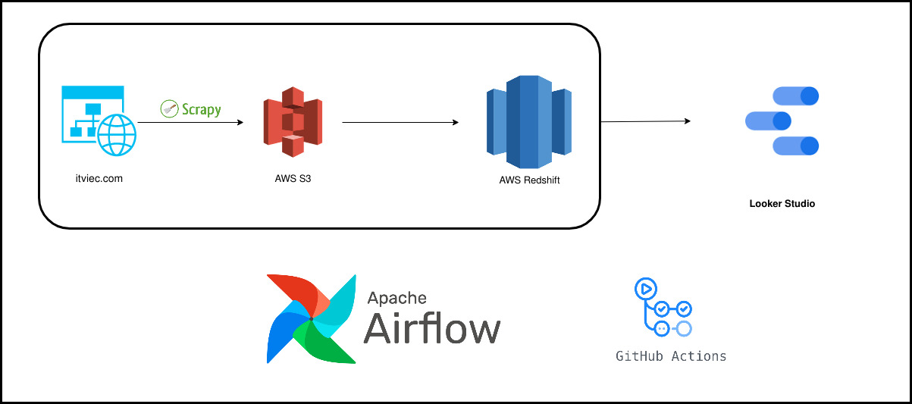
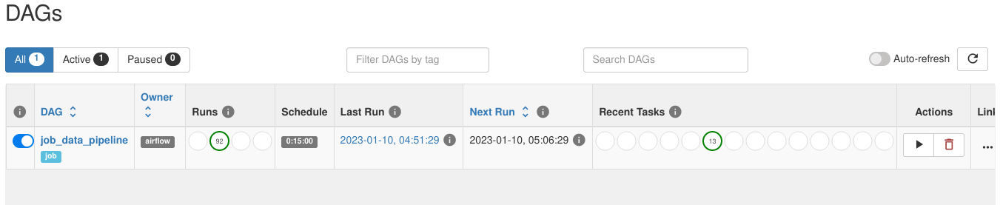
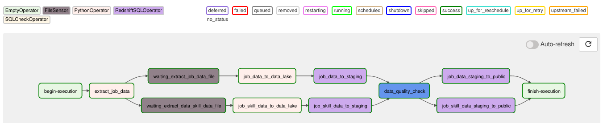
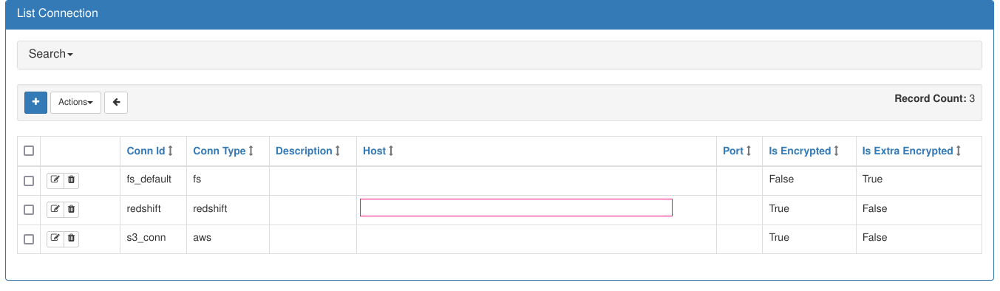
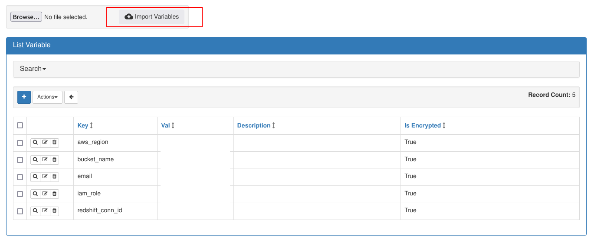
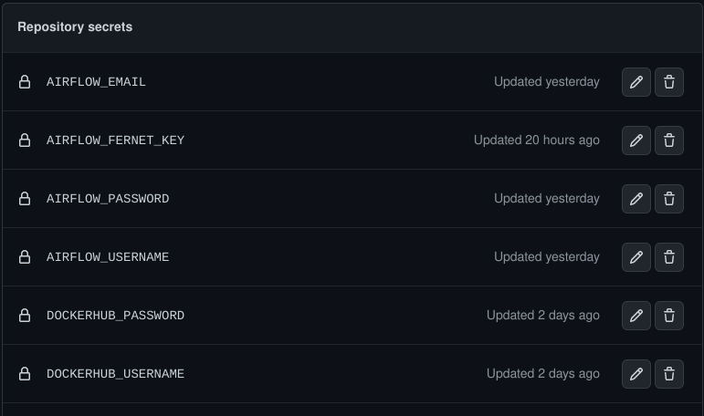
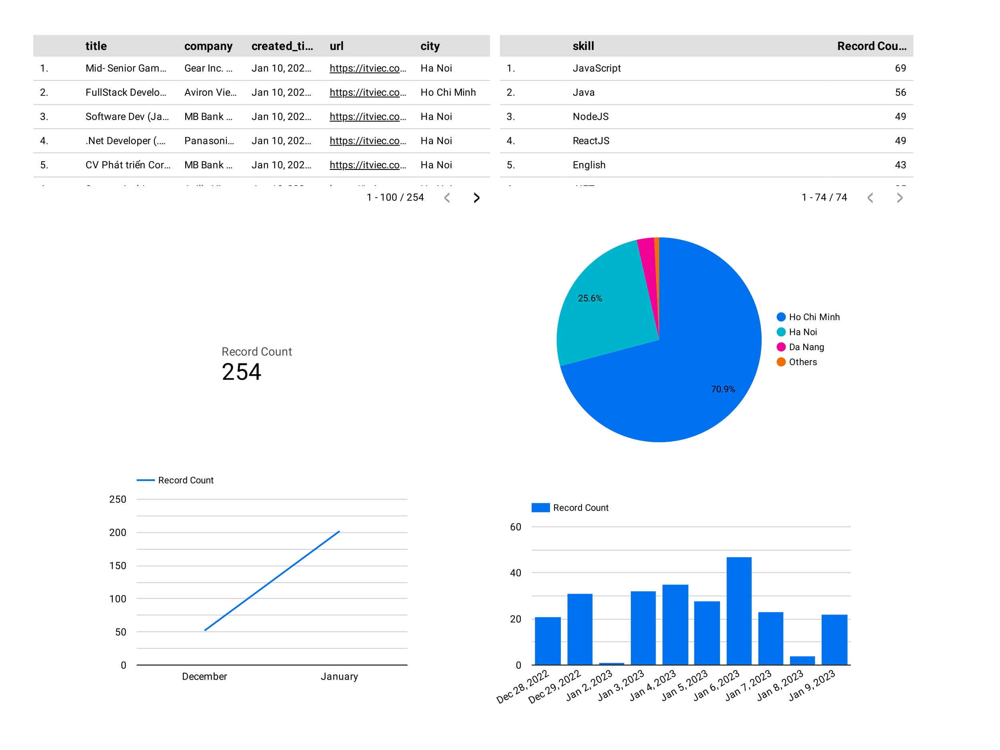

# **Job ETL Pipeline**

<!-- TABLE OF CONTENTS -->
<details>
  <summary>Table of Contents</summary>
  <ol>
    <li><a href="#motivation">Motivation</a></li>
    <li><a href="#built-with">Built With</a></li>
    <li><a href="#architecture">Architecture</a></li>
    <li><a href="#environment-setup">Environment Setup</a></li>
    <li><a href="#deployment">Deployment</a></li>
    <li><a href="#output">Output</a></li>
    <li><a href="#contributing">Contributing</a></li>
    <li><a href="#contact">Contact</a></li
  </ol>
</details>

<!-- ABOUT THE PROJECT -->
# Motivation
I want to make a beginner data engineering project, also want to look for a new job. So i made this data pipeline that crawl data from job search website, store data in data warehouse and load data to visualization tool.

# Built With

* [Airflow](https://airflow.apache.org/)
* [Amazon S3](https://aws.amazon.com/s3/)
* [Amazon Redshift](https://aws.amazon.com/redshift/)
* [Amazon EC2](https://aws.amazon.com/ec2/)
* [Looker Studio](https://datastudio.google.com/)
* [Docker](https://www.docker.com/)
* [Github Action](https://github.com/features/actions)


# Architecture


1. Extract data using `Scrapy`
2. Load raw data to `S3 bucket` 
4. Add timestamp field and upsert data to `Redshift` data warehouse
5. Use `Looker Studio (Google Data Studio)` to visualize our data 
6. Orchestrate with `Airflow` using `Docker` in `EC2 instance`
7. Implement `CI/CD` and `Unit Testing` using `Github Action`  


<br />

# Environment Setup
## Cloud Services Used  

<pre>
Redshift cluster type <b>dc2.large</b>
S3 bucket
EC2 instance type <b>t2.medium</b> 
IAM role to allow Redshift access to S3
</pre>

<br />  

## Setting Up Airflow
I use `Docker Compose` to setup Airflow. There are 3 components: `webserver`, `scheduler` and `Postgres` as our database. Details in [docker-compose.yml](docker-compose.yml)  

Pipeline DAG:



Graph View:


<br />  

## Configuring connections and variables

This pipeline uses `File System`, `Redshift` and `S3` **connections**. To configure connections, I used Airflow's UI:  




To configure **variables**, create a `json` file like this: 
```
{
	"bucket_name": "xxx",
	"aws_region": "xxx",
	"iam_role": "xxx",
	"redshift_conn_id": "Xxx",
	"email": "xx"
}

```
Then use the `Import Variables` feature in Airflow's UI:  




# Deployment

## CI/CD Pipeline  

Triggers on pushing to branch `dev`. The steps are:  

1.  Checkout our current repository
2.  Login to [Docker Hub](https://hub.docker.com/)
3.  Get short commit hash for image tag
4.  Buid push image to `Docker Hub`
5.  Unit test
6.  Deploy to `EC2 instance`
   
Details in [workflow file](.github/workflows/cicd.yml)

Use [Github Secrets](https://docs.github.com/en/actions/security-guides/encrypted-secrets) to configure secrets for this repository



# Output  

The result is vailable [here](https://datastudio.google.com/reporting/d8cf3a97-1f06-4854-8001-fb57c6b17c49). This is just a simple visualization  




<br />

<!-- CONTRIBUTING -->
## Contributing

If you have a suggestion that would make this better, please fork the repo and create a pull request. Thank you very much!


<!-- CONTACT -->
## Contact

Đức. Chu Nguyên 
- [Linkedin](https://www.linkedin.com/in/nguyenducchu1999/)
- Email: nguyenducchu1999@gmail.com
